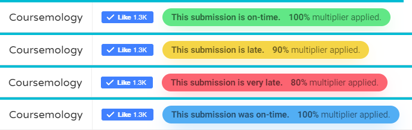

    
    <h1>GradeAssist for Coursemology</h1>
    
Automatically adjust EXP multipliers in Coursemology. <a href="https://phillmontisaweso.me" target="_blank" rel="noopener noreferrer">Made with ❤️ by Phillmont</a>

**GradeAssist** is a Chrome extension made to maintain (CS1010S) tutors' sanity by automatically adjusting submissions' EXP multipliers in Coursemology. Traditionally, tutors will
have to look out for the difference in submission and due date and accordingly adjust the EXP multiplier (0.8 or 0.9). With GradeAssist, tutors can now grade in peace.

> It is important to note that GradeAssist only changes the multiplier on the Coursemology front-end. If the tutor did not click on **Publish** or **Save** on the submission, then
> Coursemology will not save the adjusted EXP.

## Basic "traffic lights"
GradeAssist will attach a (responsive) **lightbar** right beside the Coursemology logo on the navbar. These are the four basic traffic lights:

* **Green**: Submission is ungraded, and is on-time. 1x multiplier has been applied.
* **Yellow**: Submission is ungraded, and is at most 24 hours late over the deadline. 0.9x multiplier has been applied.
* **Red**: Submission is ungraded, and is at least 24 hours late over the deadline. 0.8x multiplier has been applied.
* **Blue**: Submission is graded. The multiplier rule application is as above.
> Note that the above lateness guide is for CS1010S only. If your course requires different criteria, feel free to fork and modify the extension.

## Advanced flags
GradeAssist also supports advanced **flags** that can be applied **by the tutor** on any of the Comments section. Currently, GradeAssist supports the following flags:

The above image is NOT in any order. The following flags are listed in descending order of precedence.
* `FOVMULT`**`X`**: **Override Multiplier** (Teal)  
This flag allows the tutor to override the multiplier application and persist any multiplier where **`X`** is the 10-fold multiplier, and 0 &le; **`X`** &le; 10. For example, to override
with 0.3x multiplier, comment `FOVMULT3` anywhere on the Comments section on the submissions page.

* `FPLAG`: **Plagiarism** (Black)  
This flag allows the tutor to mark a submission as plagiarised, and by default will apply 0.5x multiplier. If the tutor wishes to mark a submission as plagiarised and apply
custom multiplier, both flags can be combined. For example, `FPLAG FOVMULT2` will mark a submission as plagiarised and apply 0.2x multiplier.

* `FODBAPPV`: **One-day Badge Approved** (Purple)  
This flag allows the tutor to grant a one-day badge (CS1010S only) to a submission and automatically grant 1x multiplier.

> Note that these flags detection will take up at most `O(n)` time complexity, where `n` is the number of comments in the submission. If your course does not require the use of
> these flags, feel free to fork and remove the flags detection block in the extension.

## Installation
As GradeAssist is not distributed in the Chrome Web Store, you will have to manually install it. 
[Download the latest version of GradeAssist here](https://github.com/purfectliterature/gradeassist/releases/latest). You will be looking for a `gradeassist-v1.x.zip` file.
1. Unpack the downloaded `gradeassist-v1.x.zip` file somewhere safe, out of sight, and out of mind.
2. Open the Chrome **Extensions page**.  
Either navigate to `chrome://extensions` or click on the three-dotted menu > More tools > Extensions.
3. In the top right corner, switch on **Developer Mode**.
4. Drag the `gradeassist-v1.x` folder extracted in step 1 to the Extensions windows.  
Alternatively, you may click on Load unpacked and browse for the `gradeassist-v1.x` folder.
5. You should be able to see the GradeAssist icon on your toolbar, or hidden under the Extensions collapsible (in newer versions of Chrome).

> GradeAssist will only run on matching sites (i.e. edit submission page on Coursemology), and if it is running, you will be able to see the GradeAssist icon in its yellow colour.
> If it is not running, it will show grey. In this case, it will not consume CPU nor memory. Even when running, GradeAssist is very power-efficient and only runs once, after
> the submission finishes loading.

## Random notes
- As of GradeAssist 1.1, the extension only works on **manually-graded submissions**.
- Issues and pull requests are welcome!
